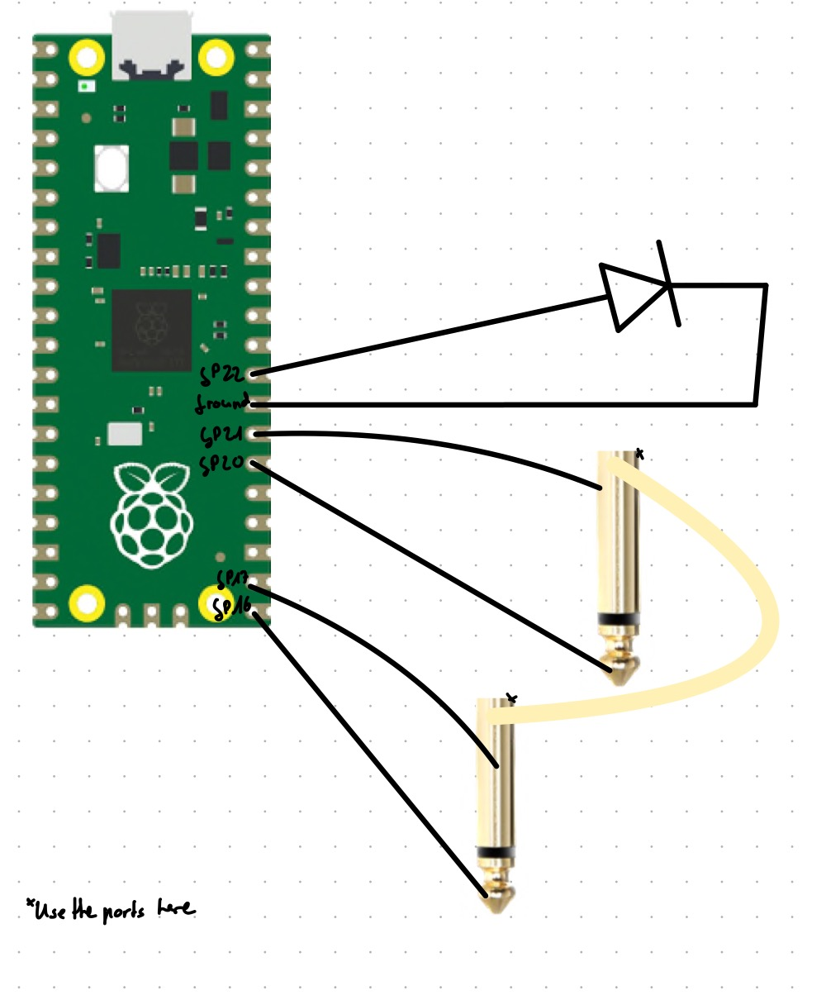

# jackCableTester

This is a concept for a (hopefully working) jack cable tester.

## Part List

- RaspberryPi pico
- 2 jack sockets
- green led
- your case of choice (e.g. a piece of wood)

## Getting Started

1. Follow [these](https://micropython.org/download/rp2-pico/) instructions
2. Copy the main.py file to the drive as well
3. Wire everything up
4. Test

## Wiring

